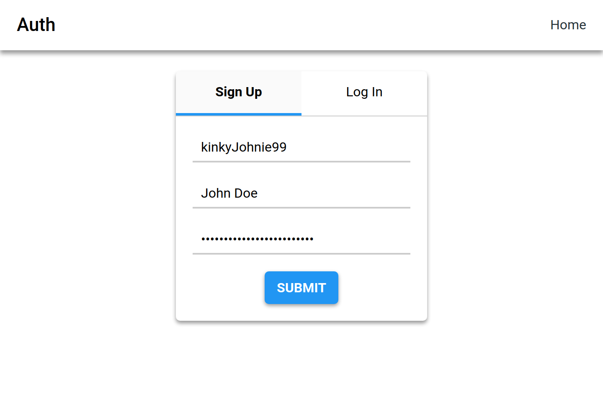

# Mess

Simple and beautiful chat web app.



## Why Mess?

1. Deploy with 3 commands (one of which is `git clone`...)
2. Fast and reliable web client written in Elm
3. Hihgly concurrent and blazingly fast Go server

## Production Deployment

I made it very simple to setup and use. You shouldn't face any problems at all.
Follow the steps:

### Clone

```bash
git clone git@github.com:sharpvik/mess.git
cd mess
```

### Setup

```bash
./setup.sh
```

### Deploy with `docker-compose`

```bash
docker-compose up
```

## Development

If you want to contribute to the project, please see [`DEVELOP.md`](DEVELOP.md)
for instructions on how to setup environment for local development.
